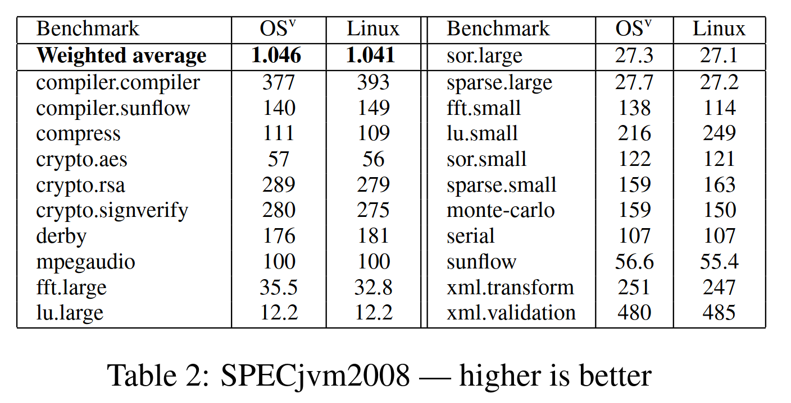
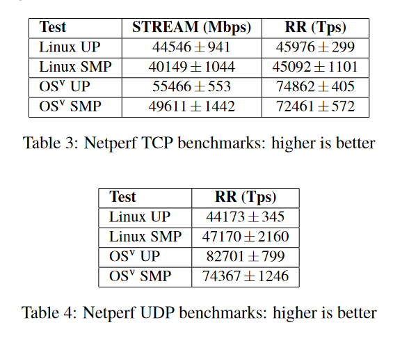
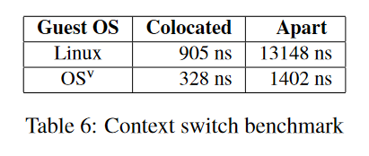

## Questions

1. Summarize the project, what it is, what its goals are, and why it exists.
2. What is the target domain of the system? Where is it valuable, and where is it not a good fit? These are all implemented in an engineering domain, thus are the product of trade-offs. No system solves all problems (despite the claims of marketing material).
3. What are the "modules" of the system (see early lectures), and how do they relate? Where are isolation boundaries present? How do the modules communicate with each other? What performance implications does this structure have?
4. What are the core abstractions that the system aims to provide. How and why do they depart from other systems?
5. In what conditions is the performance of the system "good" and in which is it "bad"? How does its performance compare to a Linux baseline (this discussion can be quantitative or qualitative)?
6. What are the core technologies involved, and how are they composed?
7. What are the security properties of the system? How does it adhere to the principles for secure system design? What is the reference monitor in the system, and how does it provide complete mediation, tamperproof-ness, and how does it argue trustworthiness?
8. What optimizations exist in the system? What are the "key operations" that the system treats as a fast-path that deserve optimization? How does it go about optimizing them?
9. Subjective: What do you like, and what don't you like about the system? What could be done better were you to re-design it?

## Hypothesis

1. Most cloud systems run some general version of Linux. However, Linux can be very bloated with isolation features that the hypervisor already gives, especially when a user only wants to run a single application. OSv offers a way to boot a single Linux application with less overhead and more memory to give to the application.

2. The target domain of OSv is in the Cloud Computing and Virtual Machine realm. On a physical machine a single OS would handle isolation, between multiple untrusted applications. However, on the cloud the hypervisor handles a lot of the isolation. This means there is an unnecessary cost to provide this isolation which OSv takes advantage of. On the other hand, OSv would not be a good idea on a physical machine or something like a Desktop OS. We can only run a single application.

3. OSv has many [components](https://github.com/cloudius-systems/osv/wiki/Components-of-OSv) in order to allow any Linux application to be able to run on OSv. This also provides a good summary of the goals of OSv.  We summarize the following components here:

- **Virtual hardware drivers**
OSv needs to be able to support a minimal set of virtual hardware. OSv supports some traditional PC hardware as well as some paravirtual drivers.

- **Filesystem**
OSv uses a file system similar to Unix "VFS" to allow application to interact with a filesystem.

- **The Loader**
OSv needs to bootup before running. The loader loads and compresses the OSv kernel into memory.

- **The Linker**
OSv runs applications. Therefore a linker is needed to map the application into memory and provide a map with symbols and where they are so that the code is runnable. Something to note here is that only dynamically-linked executables are able to be run.

- **Memory Management**
OSv needs to support applications that run things like mmap or malloc. A memory manger is needed to support these operations and decide how many pages to give and when to revoke the pages.

- **Scheduler**
OSv needs to support threads. A thread scheduler will support multiplexing threads on CPUs, guarantee fairness and provide load balancing. It is said that the scheduler is quite different than Linux.

- **Synchronization**
OSv needs to support mutexes. However, here they do not use Spinlocks and instead use a "lock-free" mutex and lock-free algorithms.

- **Supporting C library**
OSv needs to support Linux application who rely on the C library. Hence they need to implement traditional Linux system calls and glibc calls.

- **Network Stack**
OSv needs to support applications that want to use the network. OSv has an entire TCP/IP network stack.

- **DHCP client**
OSv needs to be able to support gateway applications. Therefore a DHCP client is needed to be implemented in OSv.

The OSv provides a zero-copy, lock-free API to process packets which results in a 4x increase of Memcached throughput. Also, it provides new APIs which replaced some APIs of Linux in order to reduce the much work of Linux which reduces its overhead. On the other hand, the OSv doesn’t emulate all of the parts of the Linux interfaces, such as fork() and exec(). It could increase performance at some aspects. However, the OSv also loses some diverse functions which developers need. That may cause developers to spend much more time to implement the functions.
TODO: How do these modules communicate

4. OSv tries to provide a standard Linux API so that native Linux applications can be run using OSv. However, we can take advantage of the fact that only one application is being run in OSv. For example there are APIs in OSv that give applications direct access to a page table. This can be extremely beneficial to something like Java's Garbage collector. The paper can explain it a lot better than I can:

> The Hotspot JVM uses a data structure called a card table [22] to track write accesses to references to objects. To update this card table to mark memory containing that reference as dirty, the code generated by the JVM has to be followed by a “write barrier”. This additional code causes both extra instructions and cache line bounces. However, the MMU already tracks write access to memory. By giving the JVM access to the MMU, we can track reference modifications without a separate card table or write barriers.

Essentially, by adding to the standard Linux API we can achieve better performance.

5. One of the main goals of OSv is to be a better alternative than running a Linux VM on the cloud. Therefore most of their benchmarks are geared towards showing improvements over Linux. OSv divides its benchmarks into two categories: **macro benchmarks** and **micro benchmarks**.

### Macro Benchmarks
- **Memcached**
Using an unmodified version of memcached we can see a 22% higher throughput than using Linux. However, if we use some OSv APIs described in question 4 we can get a higher throughput of 390% compared to Linux.

- **SPECjvm2008**
SPECjvm is a Java benchmark suite. We can see these improvements in a table provided in the paper.

It is interesting to note that OSv does not offer a higher improvement in computation intensive tasks compared to memory intensive tasks.

### Micro Benchmarks
- **Network Performance**
Using the Netperf benchmarking tool we see OSv request/response is better than Linux giving a 37-47% reduction in latency and 24-25% increase in single-stream throughput.

- **Context Switches**
Benchmarking tool written by the authors (*so take this info with a grain of salt*):
  - Collocated: two threads on same processor
  - Apart: two threads on different processors

6. Many components of OSv are simplified and/or modified version of other open-source projects, some of which we have already looked at in this course. There are 4 technologies in OSv which warrant discussion:
- **Memory Management**: OSv provides virtual memory with a single physical mapping, i.e. a virtual address corresponds to exactly one physical address. The kernel and all threads share the same address space. Hardware features, such as page tables, can be exposed to applications directly.
- **Absence of Spinlocks**: OSv uses a lock-free mutex implementation to avoid the "Lock Holder Preemption" problem on virtual machines. Instead of using spin-locks, the mutex's internal structures are protected by lock-free algorithms using atomic operations.  
- **Network Channels**: Packet processing in OSv flows as follows: a received packet goes to the classifier which assigns it to a channel, the channel is a single producer/single consumer queue which transfers the packet to the application thread, each channel corresponds to a specific network flow. The OSv implementation can thus reduce the number of locks needed for networking.
- **Thread Scheduler**: The OSv scheduler is essentially per-CPU scheduling. When a thread running on a CPU is preempted or needs to be rescheduled the scheduler runs on that CPU and selects a thread from that CPU's run queue to run next based on its fairness criteria. The scheduler is tick-less to reduce time wasted in the CPU rescheduling threads. To implement fairness the scheduler calculates an exponentially-decaying moving average of each threads recent runtime and selects the runnable thread with the lowest mover-average runtime. The selected thread is allotted the amount of time that is the maximum amount of time before its runtime moving-average exceeds that of the runner up.

Some of the interactions between these technologies are clear:
- Per-CPU scheduling eliminates the need for locks in the scheduler which aligns with the absence of spin-locks on the system at all.
- The use of network channels reducing the number of locks needed for networking in general also aligns with the "simplification" ethos of the system.

Other interactions are more interesting:
- Interrupts are handled in threads rather than and interrupt handler. The elimination of spin-locks makes a traditional interrupt context difficult (if not impossible) to implement well. Instead interrupts are handled by threads which are simply woken up by an interrupt and like any thread on the system can use a mutex if locking is needed. Not only does this align with the absence of spinlocks, it is also efficient because context switches in the single address space and protection domain are extremely efficient.

7. TODO

8. The goal of OSv is to optimize virtual machines for a single application by eliminating the unnecessary features included in a general-purpose OS VM. It's compact nature means boot time is incredibly fast. The single address space shared by the kernel and all threads makes context switches and scheduling are much more efficient. By eliminating spin-locks from the system entirely and the need for spin-lock functionality in many components of the system OSv does not suffer from the Lock Holder Preemption problem seen on other virtual machines. The use of network channels simplifies networking by eliminating many typical shared data structures and the locks needed to protect them.

9. **Sarah's Opinions**: OSv seems like a compromise between VM and container because it merges the isolation of a VM with the small-and-fast nature of a container. I found the elimination of spinlocks extremely interesting, but I am still skeptical. I would also like to dig deeper into the interrupt-handling threads. By design the system is very limited and the limitations make many of the above optimizations possible; however, I have to assume there are single application cases not suited to OSv. At this point I would guess disk intensive tasks are not well suited to OSv. It is unfortunate that `fork` and `exec` are not available. Additionally, the authors of the original paper noted that the dramatic improvements they saw during their analysis came from additions to OSv, i.e. these improvements would only be available to applications aware they are running on OSv which make use of the additions. This seems to counter the original purpose of OSv being a replacement for general Linux VMs. It implies OSv is a complete alternative and applications should be designed *for OSv* instead; however, there are cases not suited to OSv which would then create a divide between OSv apps and non-OSv apps and simply add more complex classifications to already wildly complex world of app development.

10. **Cuidi**: \[isolation and memory]OSv provides the isolation for a single application. Because an application always uses multiple processes, OSv might provide a way to make those processes work together with fewer duplications. It may give multiple processes a way to share memory in an application. 

11. **Cuidi**: \[Performance]OSv could boot as fast as 5ms and could run on many hypervisors, I guess it may reduce much unnecessary libraries of Linux. Because it is unikernel, that means the OSv should be compiled with applications together. Therefore, the developers could customize the kernel and library before using it. 

12. **Cuidi**: Unikernel may be a great idea for developers and companies. In that case, I’m curious about the what applications could be used in that condition. Because OSv is a light version of Linux, that means OSv is still strong enough as Linux except the diverse functions and libraries of Linux. The virtual machine could be the bottleneck for the performance of OSv to behave better for an application with a heavy load. 
