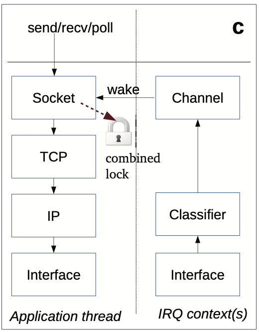

## Modules
In this section we will discuss what modules the OSv has and the relationship between those modules.

OSv modules include shared memory, networking channels, and thread scheduler. At first, we have processes that make a call down into the “kernel”. The “kernel” provides a classifier associated with a channel which is a single producer/single consumer queue. Then the channel transfers packets to the application thread. It saves much processes in the traditional network stack and removes the lock and cache-line contention. Also, during this progress OSv allows only one thread to access the data which is stored in a single address space. Compared to the traditional thread scheduler, OSv’s thread scheduler does not use spin-locks and sleeping mutex. Moreover, based on the fairness criteria of threads on the CPU’s run-queue, the scheduler chooses the most appropriate thread to do the next operation which keeps the queue of one CPU not much longer than others’, which is efficient.

Let's dive into the modules a little bit now.

### 1. Virtual Memory

At first, OSv doesn't have multiple spaces. OSv runs an application with the kernel and threads sharing a single space. It means the threads and kernel use the same tables, which make system calls as efficient as function calls and also make context switches quicker. Also, because OSv share a single address space, it doesn't maintain different permissions for the kernel and applications. Therefore, the isolation is managed by the hypervisor. This way achieves simpler code, better performance and also reduces the frequency of TLB misses.

### 2. Networking channels

OSv provides a new network channel so that only one thread could access the data which simplifies the locking. Most of TCP/IP is moved from kernel to the application level, while a tiny packet classifier is running in an interrupt handling thread. Therefore, it could reduce the run time and context switches overhead. The code is implemented in net_channel.cc. It shows that after finding the ipv4 packet which has the same item in the hash table, it will use the pre-channel and wake it up.
```c
bool classifier::post_packet(mbuf* m)
{
    WITH_LOCK(osv::rcu_read_lock) {
        if (auto nc = classify_ipv4_tcp(m)) {
            log_packet_in(m, NETISR_ETHER);
            if (!nc->push(m)) {
                return false;
            }
            // FIXME: find a way to batch wakes
            nc->wake();
            return true;
        }
    }
    return false;
}
```

<p align="center">  </p>

### 3. Thread Scheduler

OSv is designed to use the scheduler which runs different queues on each CPU. Therefore, almost all scheduling operations do not need coordination among CPUs and the lock-free algorithms when a thread must be moved from one CPU to another.

#### 3.1 Lock-free algorithm

OSv assumed that only a single pop() will be called at the same time, while push()s could be run concurrently. The push() code is like the following. Because only the head of the pushlist is replaced, before changing the head, they will check whether the head is still what they used in item-next, which guarantee that changing is correct.

```c
inline void push(LT* item)
    {
        // We set up item to be the new head of the pushlist, pointing to the
        // rest of the existing push list. But while we build this new head
        // node, another concurrent push might have pushed its own items.
        // Therefore we can only replace the head of the pushlist with a CAS,
        // atomically checking that the head is still what we set in
        // item->next, and changing the head.
        // Note that while we have a loop here, it is lock-free - if one
        // competing pusher is paused, the other one can make progress.
        LT *old = pushlist.load(std::memory_order_relaxed);
        do {
            item->next = old;
        } while (!pushlist.compare_exchange_weak(old, item, std::memory_order_release));
    }
```

#### 3.2 Thread scheduling

OSv shedule has global fairness and is easy to compute. Each task has a measure of runtime it receives from the scheduler. The scheduler picks the runnable thread with smallest R, and runs it until some other thread has a smaller R.

Beside of keeping each CPU has its own separate run-queue, which removes the lock mechanism, OSv uses a load balancer thread on each CPU so that it could keep the run queue in one CPU have similar tasks as others. If the queue of one CPU is longer than others', the load balancer thread will pick one thread from this CPU and wakes it up on the remote CPU. The more detailed implementation about schedule is [here](https://github.com/cloudius-systems/osv/blob/master/core/sched.cc#L724-L771):

```c
// This CPU is temporarily running one extra thread (this thread),
        // so don't migrate a thread away if the difference is only 1.
        if (min->load() >= (load() - 1)) {
            continue;
        }
WITH_LOCK(irq_lock) {
	... ...
	... ...
	min->send_wakeup_ipi();
}
```


Ax explained above, when OSv calls down to the data, it shares a single address space and avoids context switches. Also, by using the “channel”, OSv saves much processes in the traditional networking stack. OSv avoids the socket locks and TCP/IP locks. According to the performance result, the network stack’s performance for TCP and UDP consistently outperforms Linux and latency is about 25% less than Linux. Also, the context switching (thread switching) is much faster in OSv than in Linux - between 3 and 10 times faster.
