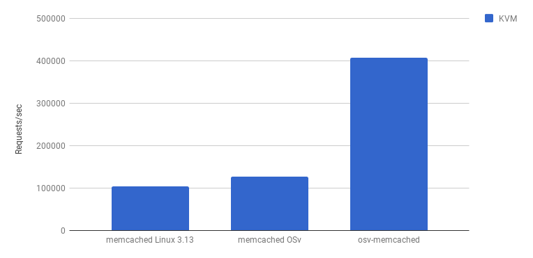
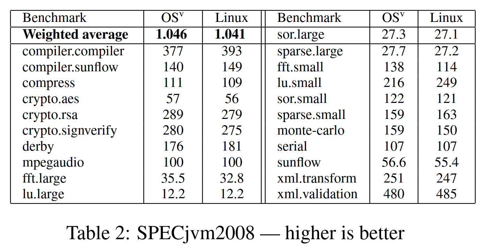

\newpage

# Performance
In this section we will discuss and provide examples of performance. We will also provide hypothesis for why certain performance measures are better than others. We will break down perforance based on the two types of tests performed in the paper: Macrobenchmarks and Microbenchmarks. 

## Macrobenchmarks

A macrobenchmark is a test that can run over multiple elements. It will usually test an entire application. We will examine two different macrobenchmarks: 

- Memcached
- SPECjvm2008

### Memcached 
Here is the same figure that we presented in section 4 about memcached, but will focus on all different types of memcached. 

As we can see from the figure there are three different types of memcached: 

- memcached Linux 3.13
This is a generic version of memcached running on the Linux kernel. This is what you would find in a memcached in the wild. 

- memcached OSv
This is a generic verion of memcached, but instead of running on Linux its source code is fused together with OSv. 

- osv-memcached
This is a special version of memcached using the APIs discussed in aprt 4.

As we can see, simply compiling the same memcached source code that runs on Linux into OSv we can an improvement of around 20%. We hyppthesize this is because memory accsess are faster in memcached because there is only one address space that has to be dealt with. This means we can give more memory to memcached then we normally could with a kernel which allows it to go faster. We can even get faster performance by using the API detailed in part 4. 

### SPECjvm2008
SPECjvm2008 is a suite of a variety of applications. It optimizes for testing the performance of the JVM, which is what OSv will be running. 

#### Computation intensive tasks
The first thing that we notice is that this performance is a farcry away from the perforance boost of memcached. This is because a lot of the tasks are Computation intensive tasks which OSv can not optimize too much for.

#### Filesystem intensive tasks 
There are even some aspects that are slower for example `compress` and `crypto.rsa`. These tasks focus on using the file system. The fileystem is just a ZFS bolted onto the kernel, which is not as optimized to the level as the Linux File system is. 

## Microbenchmarks
Instead of focusing on an application as a whole, Microbenchmarks focus on specific elements of applications i.e networking. We will focus on two specific benchmarks:

- Networking benchmarks
- Context Switching benchmarks

### Networking
To measure networking benchmarks we use netperf which sends requests and packets between 2 hosts on the same network and measures the performance. The paper provides the following table: 

As we can see OSv consistenly outperforms Linux as far as networking is concerned. This is because OSv does not have to deal with complicated lock structures or expensive context switches when changing threads while networking. 

### Context Switching benchmarks
The contest switching benchmark was homemade. It simply measured the average time of a number of a predertmined number of context switches between threads. 

OSv is better at context switching. This is because of all the optimizations that the thread scheduler has. Using lock-free algorithms and idle-time polling.

As we can see there are variety of places where OSv performs better and some places where OSv may perform worse. 
